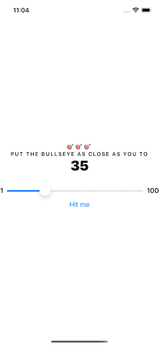
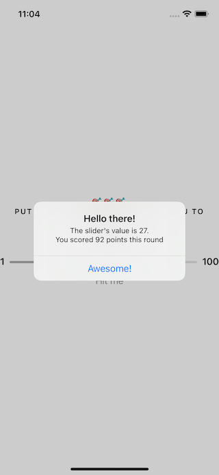
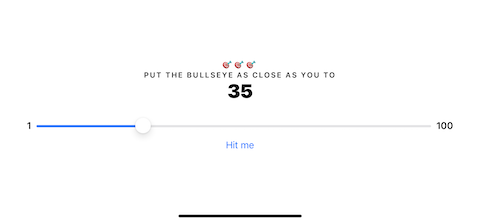
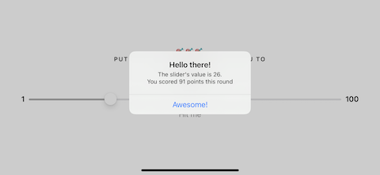
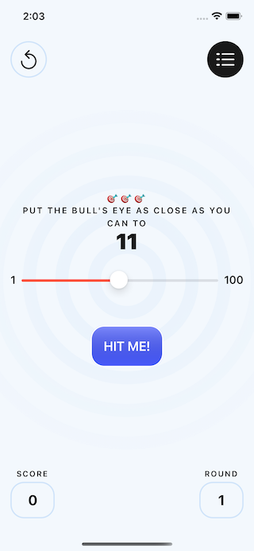
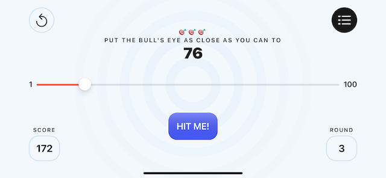
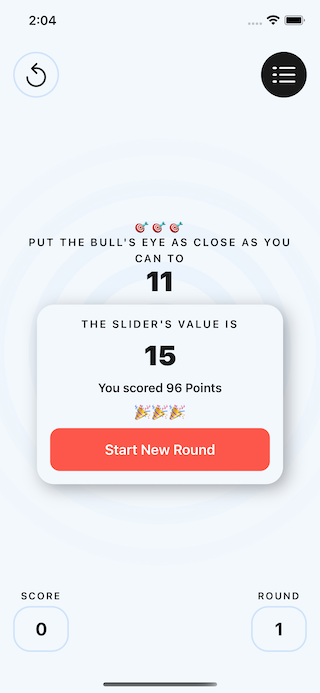
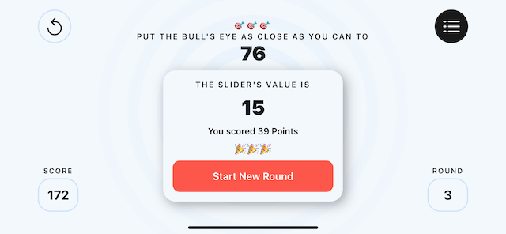
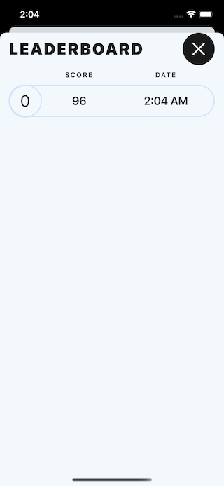
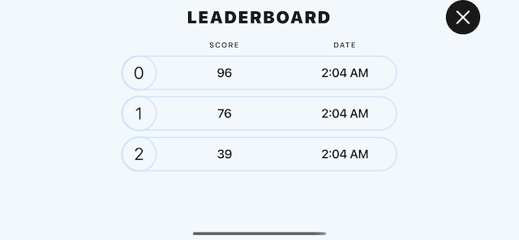

# Bull's Eye (SwiftUI)

This simple game will help you to dive in some of SwiftUI features, the main goal of the game is to scroll the target closer the given value.

# 1-app-from-scratch

All the process 'til here will cover creating an app from scratch with the basic functionality to make it work, the design is just plan, cute, but plain to make it look just good, the idea was to see and learn about `States`, `Bindings`, `SwiftUI`, how the sync works between code and UI, how to organize our code files, `Unit Test`, how to backup our code through tests to feel confident when refactor.

| SS01 | SS02 |
| ---- | ---- |
|  |  |

| SS03 | SS04 |
| ---- | ---- |
|  |  |

# 2-polishing-the-app

On this process you'll notice some new features and an improvement on the design!.

| SS05 | SS08 |
| ---- | ---- |
|  | 

| SS06 | SS09 |
| ---- | ---- |
|  | 

| SS07 | SS10 |
| ---- | ---- |
|  | 